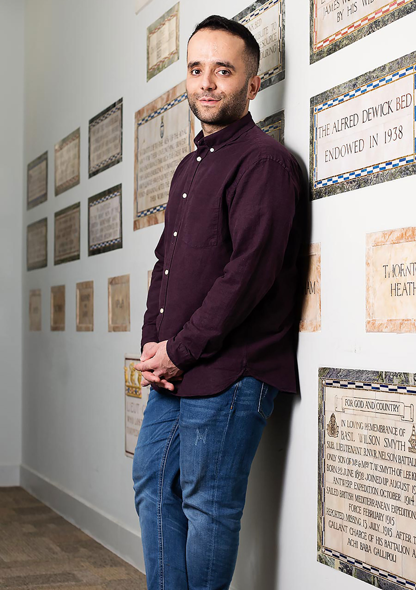

<div align="center">



# Mohamed AL-Kaisi

**Senior Data Engineer | MLOps Specialist**

[](https://www.linkedin.com/in/mohamed-al-kaisi/)
[](mailto:malkaisi92@gmail.com)
[](https://visinova.co.uk/)
[](https://www.gre.ac.uk/portraits/alumni/mohamed-al-kaisi)

</div>

---

### About Me

From arriving in the UK as a refugee from Iraq in 2009 to building data platforms for UK Government departments - my journey has been driven by a belief in the transformative power of technology and education.

I'm an AI/ML Computational Science Specialist with 4+ years of experience building scalable data pipelines, ML infrastructure, and cloud-native platforms. I specialise in transforming complex data challenges into production-grade solutions, from ETL pipelines to real-time ML inference systems.

Beyond code, I'm passionate about community impact:
- **[Greenwich Alumni Changing Lives Award (2024)](https://www.gre.ac.uk/articles/public-relations/the-university-of-greenwichs-alumni-award-winners-2024)** - recognised as "a true changemaker" for organising hackathons, Sanctuary in Education events, and advocating for refugee students
- **[Trustee at Compass Collective](https://www.compasscollect.com/board-of-trustees)** - raising awareness of refugee experiences through performing arts
- **Greenwich Portrait Award** - selected as top 3 young leader at the university
- **Two UNICEF Platinum Awards** and **Croydon Volunteer of the Year**
- **Founded** Student Action for Refugees and GreDevJams Society at University of Greenwich
- **Founding artist** in "The Paper Project" - exploring migrant and refugee experiences

---

### Tech Stack

```text
Data Engineering    Python | SQL | PySpark | AWS Glue | Redshift | Azure Fabric
MLOps               SageMaker | Bedrock | Lambda | EC2 | Docker
Infrastructure      Terraform | VPC Architecture | CI/CD
Analytics & BI      Power BI | QuickSight | PostgreSQL | Oracle DB
```

<div align="center">


</div>

---

### Certifications

<div align="center">

| Cloud & Infrastructure | Data & AI |
|:----------------------:|:---------:|
| AWS Data Engineer Associate | Azure Data Scientist Associate |
| AWS Cloud Practitioner | Azure Power BI Data Analyst Associate |
| Terraform Associate | Azure AI Fundamentals |
| Azure Fundamentals | Azure Data Fundamentals |

</div>

---

### Education

| Degree | Field |
|--------|-------|
| **MSc** | Big Data and Business Intelligence |
| **BSc** | Computer Science |

---

<div align="center">

### GitHub Stats


---

*Building reliable data systems for the public sector*

</div>
